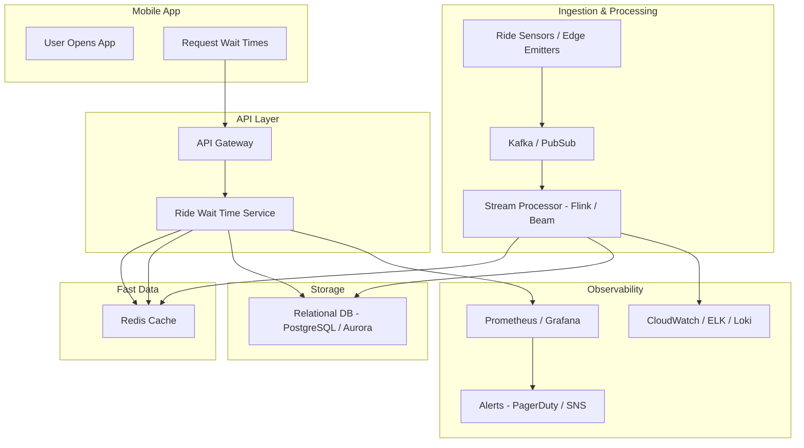

# 🎢 DevOps Architecture Interview Cheat Sheet: Amusement Park System

## 🔍 Focus of Interview
- Whiteboard-based (Codility)
- System Design in the Amusement Park domain
- DevOps mindset: scalability, monitoring, cost, automation
- Clear communication & layered thinking

---

## 🧩 Core System: Ride Wait-Time Tracking

### Architecture (High-level)
- **Sensors** → Kafka/PubSub → Stream Processor (Flink/Beam) → Redis → API
- API (stateless, REST/gRPC) → exposed to Mobile App via Gateway
- Persist long-term data in relational DB (Aurora/Cloud SQL)
- Monitor via Prometheus + Grafana, logs to CloudWatch/ELK

---

## 🛡️ High Availability
- Multi-AZ deployments
- Stateless services (ECS/EKS/K8s)
- Redis & DB: managed with replicas + automatic failover
- Health checks + auto-heal via orchestrator

---

## 📈 Scalability
- Kafka/PubSub partitions for ingestion scale
- Redis for fast reads (TTL 5–10m)
- Horizontal scaling via Kubernetes or ECS
- Stream processing with checkpointing & replay

---

## 💰 Cost Optimization
- Use serverless where possible (Lambda, Cloud Run)
- Redis TTL avoids over-caching
- Use spot instances or savings plans
- Batch writes & aggregate metrics to reduce cost

---

## 🧠 CI/CD & IaC
- GitOps or GitHub Actions + Terraform/CDK
- Canary or blue/green deploys with rollback strategy
- Artifacts in ECR or Artifactory
- Test, monitor & auto-rollback if health degrades

---

## 🛠️ Monitoring & Observability
- Logs: CloudWatch / Loki / ELK
- Metrics: Prometheus (latency, errors, stream lag)
- Alerts: SNS/PagerDuty on SLOs
- Dashboards for ops + anomaly detection

---

### 📈 Diagram

---

🧠 What It Shows:

Mobile app requests go through API Gateway to the Ride Wait Time Service.

Service checks Redis cache and updates from the DB.

Sensors emit events into Kafka/PubSub.

Stream processor updates Redis + DB with fresh wait time estimates.

Logs/metrics feed observability and alerts.

---

## 🗣️ Key Mock Q&A Points

| Question | Quick Answer |
|---------|--------------|
| Scale ingestion? | Kafka partitions, autoscaling processors |
| Redis HA? | Multi-AZ Redis (ElastiCache/Memorystore) |
| Detect stale data? | TTL + Prometheus alert on age of data |
| Cost savings? | Serverless, TTLs, batching, spot compute |
| Rollback deploy? | Canary + health checks + automated rollback |
| gRPC vs REST? | REST for external, gRPC for internal S2S |

---

✅ Be concise → start small, evolve based on prompts  
✅ Speak to trade-offs clearly  
✅ Show operational awareness — monitoring, cost, rollback  
✅ Communicate clearly — they assess how you **think aloud**

---
