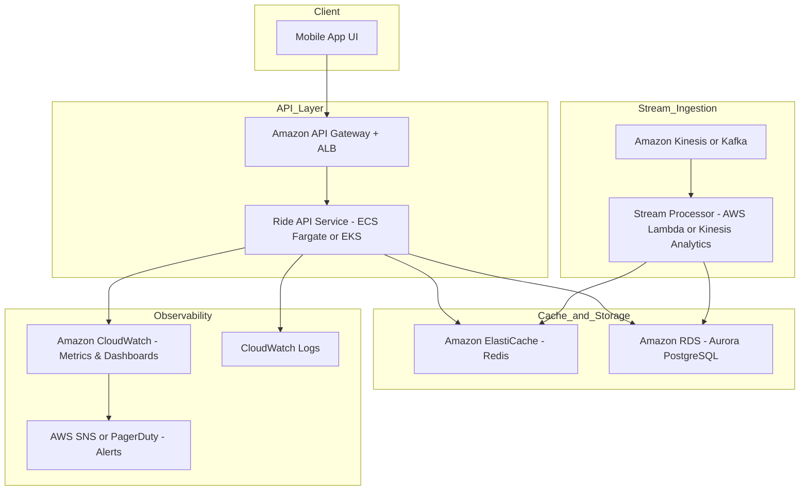

## 📐 Design Properties (AWS-Specific Architecture)

### 📈 Diagram

### ✅ High Availability

- **Multi-AZ Deployments**:
  - API Gateway, ALB, ECS (Fargate), EKS, Aurora PostgreSQL, and ElastiCache all support Multi-AZ configurations to ensure fault tolerance.
  
- **Auto Scaling**:
  - ECS/EKS can auto-scale based on CPU, memory, or custom metrics (via CloudWatch).
  - Aurora supports read replicas and failover to standby nodes.
  
- **Stateless Services**:
  - API and microservices are stateless, allowing easy horizontal scaling and resiliency.

---

### ⚖️ Scalability

- **Event-Driven Ingestion**:
  - Amazon Kinesis or MSK (Kafka) handles high-throughput sensor data with partition-based scaling.
  
- **Compute**:
  - ECS Fargate scales containers dynamically per load.
  - EKS supports advanced scaling (e.g., HPA, Cluster Autoscaler).

- **Storage**:
  - ElastiCache (Redis) handles hot-path data (e.g., current wait times).
  - Aurora scales horizontally for reads, vertically for writes.

- **Stream Processing**:
  - AWS Lambda or Kinesis Data Analytics enables decoupled and scalable stream transformations.

---

### 💰 Cost Optimization

- **Pay-per-Use Services**:
  - Lambda, Kinesis, and Fargate are billed per usage, helping minimize idle resource costs.

- **TTL & Tiering**:
  - Redis cache entries expire after a short TTL (e.g., 5–10 mins), avoiding overconsumption.
  - Logs can be offloaded to Amazon S3 from CloudWatch to reduce long-term retention costs.

- **Serverless & Spot Options**:
  - Aurora Serverless v2 enables scale-to-zero for dev/test workloads.
  - Spot instances or savings plans for ECS/EKS nodes where applicable.

- **Observability Cost Control**:
  - Use CloudWatch metric filters selectively.
  - Consider OpenTelemetry with Amazon Managed Prometheus/Grafana to centralize observability with cost control.
