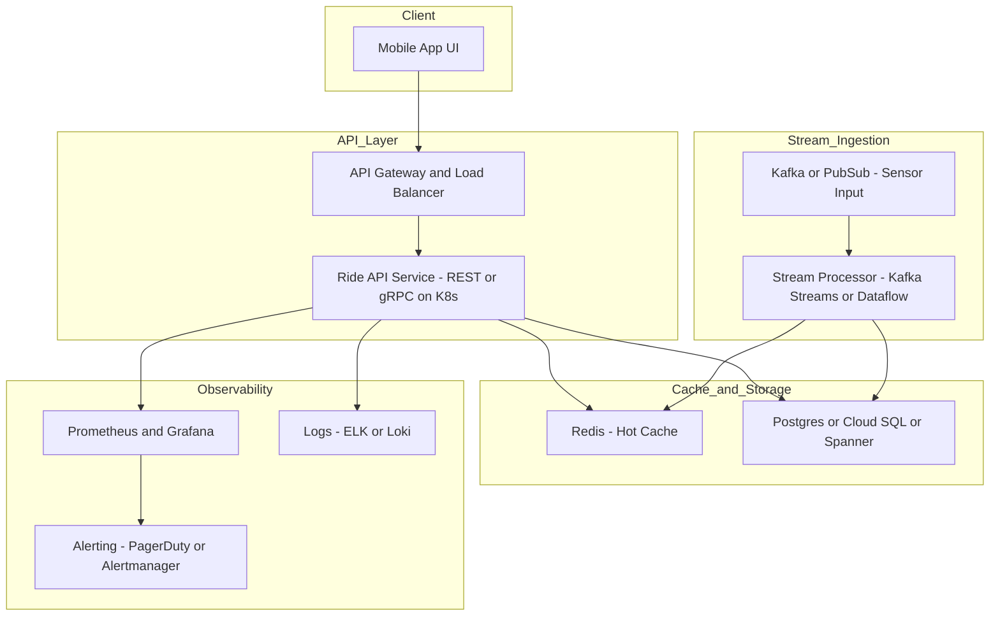

## 🎢 Ride Wait-Time Tracking System (Cloud-Agnostic Design)

### 🧱 Architecture Summary

This system provides real-time ride wait-time updates to a mobile app using a microservices and event-driven architecture. It ingests sensor data, processes it to compute average wait times, caches it for fast access, and stores it for long-term analytics.

---

### 🧩 Core Components

- **Client**: Mobile app interface used by customers.
- **API Gateway / Load Balancer**: Routes external requests to backend services.
- **Ride API Service**:
  - Stateless microservice.
  - Exposes REST/gRPC endpoints to retrieve wait times.
- **Cache Layer**: Redis or Memcached for low-latency access to current wait times.
- **Database**: Relational database (e.g., PostgreSQL, MySQL) for persistent storage of ride data.
- **Stream Ingestion**:
  - Kafka or equivalent message broker.
  - Receives real-time sensor updates (e.g., ride entry/exit events).
- **Stream Processing**:
  - Apache Flink, Kafka Streams, or Apache Beam.
  - Calculates rolling averages or aggregates in real time.
- **Observability Stack**:
  - Metrics: Prometheus or OpenTelemetry exporters.
  - Logs: ELK, Loki, or fluent-bit-based logging.
  - Alerts: PagerDuty, OpsGenie, or email/SMS integrations.

---

### 📈 Diagram

---

### 🛡️ High Availability

- Deploy microservices behind load balancers across multiple availability zones.
- Stateless services enable horizontal scaling.
- Use highly available deployments of Redis and PostgreSQL with failover support.

---

### 📈 Scalability

- Microservices architecture enables independent scaling of API, processing, and data layers.
- Kafka or similar supports partition-based horizontal scale.
- Redis handles high read volume efficiently.
- Use connection pooling and read replicas for database scale.

---

### 💰 Cost Optimization

- Use TTLs on Redis cache keys to control memory usage.
- Batch sensor writes to reduce DB load.
- Use container orchestration (Kubernetes, Nomad) with autoscaling.
- Centralized observability with retention limits and external log storage (e.g., to object storage).

---