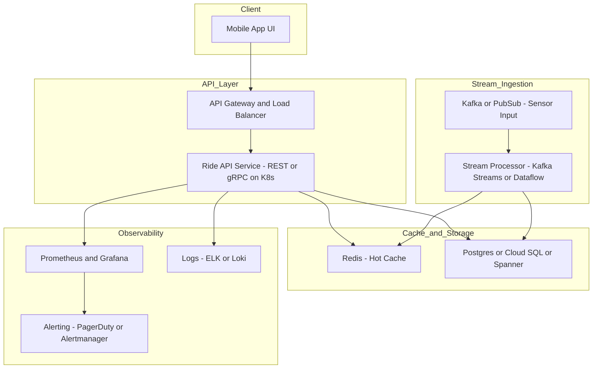

```mermaid
graph TD

subgraph Client
    A[Mobile App UI]
end

subgraph API_Layer
    B[API Gateway and Load Balancer]
    C[Ride API Service - REST or gRPC on K8s]
end

subgraph Cache_and_Storage
    D[Redis - Hot Cache]
    E[Postgres or Cloud SQL or Spanner]
end

subgraph Stream_Ingestion
    F[Kafka or PubSub - Sensor Input]
    G[Stream Processor - Kafka Streams or Dataflow]
end

subgraph Observability
    M[Prometheus and Grafana]
    N[Logs - ELK or Loki]
    O[Alerting - PagerDuty or Alertmanager]
end

A --> B --> C
C --> D
C --> E
F --> G --> D
G --> E

C --> M
C --> N
M --> O
```