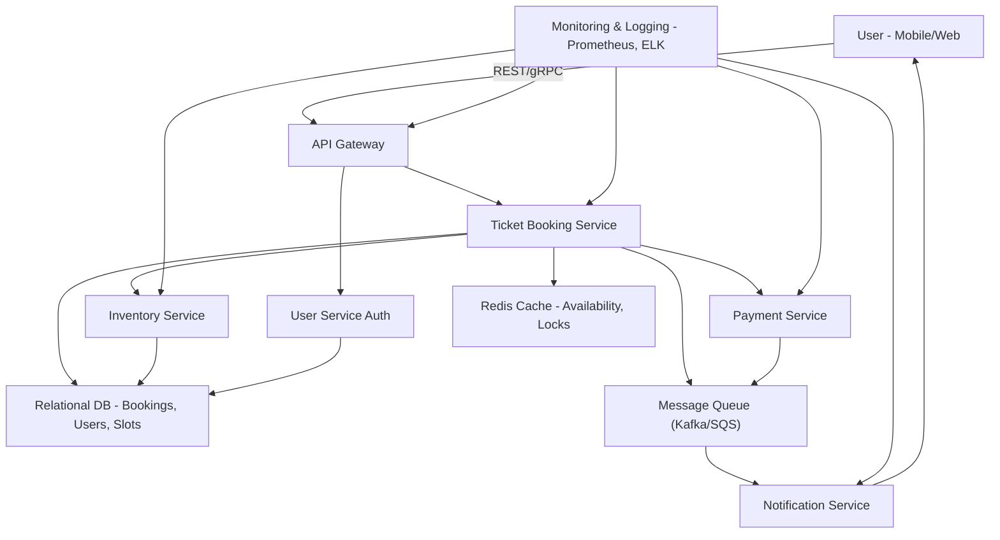

# 🎟️ Ticket Booking System – DevOps Architecture Cheat Sheet

---

## 🧩 Functional Overview
- Users can view, book, and cancel tickets
- Ticket types: general, fast pass, group
- Real-time availability check
- Online payments with confirmation (email/SMS)
- Prevent overbooking and allow refunds

---

### 📈 Diagram

---

## 🏗️ Core Components
- **API Gateway**: Entry point
- **Ticket Booking Service**: Booking logic
- **Inventory Service**: Manage slot availability
- **Payment Service**: Integrate with Stripe/Square
- **Notification Service**: Email/SMS confirmations
- **User Service**: Auth and sessions
- **Relational DB**: Bookings, users, availability
- **Redis**: Fast lookup & locks
- **Kafka/SQS**: Async workflows (e.g. payments, notifications)
- **Monitoring**: Prometheus, Grafana, ELK/CloudWatch

---

## ⚙️ Scalability
- Cache ticket availability in Redis
- API autoscaled via K8s/ECS/Fargate
- Async payment + notification via queues
- CDN for static content
- Read replicas or sharded DB

---

## 🛡️ High Availability
- Multi-AZ DB + Redis with failover
- Circuit breakers for external systems
- Health checks, retries, graceful fallbacks

---

## ⛔ Preventing Overbooking
- Pessimistic locking with DB transactions (`SELECT FOR UPDATE`)
- Redis atomic counters or Lua scripts
- Slot "soft lock" during checkout
- Confirm booking only after payment success

---

## 📊 Monitoring & Metrics
- Booking success/failure rate
- Inventory update lag
- Payment gateway errors
- API latency, 5xx rate
- Queue depth and retries

---

## 🔐 Security & Auth
- HTTPS-only APIs
- JWT/OAuth2 for user auth
- Tokenized payments (PCI-compliant)
- Encrypt PII at rest + in transit
- Rate limiting, audit logs

---

## 💰 Cost Optimization
- Serverless (Lambda/Cloud Run) for bursty tasks
- Redis TTL to limit cache growth
- Spot/preemptible compute for batch jobs
- Batch refunds/notifications to reduce traffic

---

## ❓ Common Mock Q&A

**Q: How to prevent overbooking?**  
A: DB locking or Redis atomic counters with fallback.

**Q: Handle payment failure?**  
A: Queue-based retry logic, rollback if needed.

**Q: How to scale under load?**  
A: Cache, autoscale APIs, async via queues.

**Q: What metrics to track?**  
A: API error rate, queue depth, latency, booking volume.

**Q: How to secure PII?**  
A: HTTPS, encryption, JWT, tokenized payment.

**Q: Cost savings?**  
A: Use serverless, cache with TTLs, batch non-critical tasks.

---
